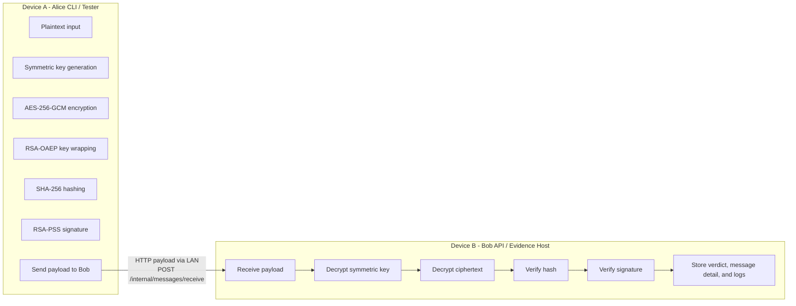

# II3230 End-to-End Secure Message Delivery

Implementasi tugas **II3230 - Keamanan Informasi** untuk topik **End-to-End Secure Message Delivery**. Repository ini membangun skenario pengiriman pesan aman dari Alice ke Bob dengan kombinasi:

- enkripsi simetris untuk melindungi plaintext,
- enkripsi asimetris untuk melindungi symmetric key,
- hash untuk verifikasi integritas,
- digital signature untuk autentikasi dan non-repudiation,
- pengiriman payload antar host melalui jaringan berbasis IP,
- verifikasi penuh di sisi Bob.

## Identitas

**Mata Kuliah**  
II3230 Keamanan Informasi K

**Judul Tugas**  
End-to-End Secure Message Delivery

**Anggota Kelompok**

| Nama | NIM |
| --- | --- |
| Keane Putra Lim | 18223056 |
| M Khalfani Shaquille | 18223104 |

## Daftar Isi

- [Ringkasan Proyek](#ringkasan-proyek)
- [Quick Start](#quick-start)
- [Arsitektur Singkat](#arsitektur-singkat)
- [Tech Stack](#tech-stack)
- [Struktur Repository](#struktur-repository)
- [Environment dan Key Setup](#environment-dan-key-setup)
- [Menjalankan Sistem](#menjalankan-sistem)
- [Pengujian](#pengujian)
- [Script Operator](#script-operator)
- [Artefak dan Logging](#artefak-dan-logging)
- [Dokumentasi Tambahan](#dokumentasi-tambahan)
- [Troubleshooting](#troubleshooting)

## Ringkasan Proyek

Sistem ini menggunakan dua peran utama:

- **Alice**
  - menyiapkan plaintext,
  - membangkitkan symmetric key,
  - mengenkripsi plaintext,
  - mengenkripsi symmetric key dengan public key Bob,
  - membuat hash,
  - membuat digital signature,
  - mengirim payload ke Bob.
- **Bob**
  - menerima payload,
  - mendekripsi symmetric key,
  - mendekripsi ciphertext,
  - memverifikasi hash,
  - memverifikasi signature,
  - menyimpan verdict, message detail, dan event log.

Jalur validasi utama repository ini adalah **dua device dalam satu LAN**:

- Device A menjalankan Alice CLI / tester
- Device B menjalankan Bob API / evidence host

## Quick Start

### 1. Install dependency dan build project

```powershell
npm install
npm run build
```

### 2. Generate key lokal

```powershell
npm run keys:generate:local
```

### 3. Jalankan Bob di device Bob

```powershell
npm run bob:lan -- --env-file .env.bob.local
```

### 4. Jalankan happy path dari device Alice

```powershell
npm run test:e2e:local -- --env-file .env.alice.local
```

### 5. Jalankan tamper suite dari device Alice

```powershell
npm run test:e2e:tamper -- --env-file .env.alice.local
```

Jika Anda ingin panduan LAN yang lebih lengkap dan berurutan, lihat [Local LAN Runbook](docs/local-lan-runbook.md).

## Arsitektur Singkat



Catatan penting:

- jalur validasi utama menggunakan `POST /internal/messages/receive`
- `POST /messages` tetap tersedia, tetapi bukan jalur utama untuk validasi LAN dua device

## Tech Stack

| Area | Teknologi |
| --- | --- |
| Runtime | Node.js |
| Bahasa | TypeScript |
| Backend | Express |
| Validasi | Zod |
| Kriptografi | Node.js `crypto` |
| Logging | Pino |
| Persistence | SQLite |
| ORM / migration | Drizzle ORM / Drizzle Kit |
| Testing | Vitest |
| Script runner | tsx |

## Struktur Repository

```text
apps/
  api/
artifacts/
  local-tests/
docs/
  adr/
  local-lan-runbook.md
internals/
packages/
  shared/
scripts/
```

Ringkasan folder penting:

- `apps/api/`
  - backend Bob dan orchestration layer
- `packages/shared/`
  - shared contract, schema, dan helper crypto
- `scripts/`
  - script operator, launcher, dan harness pengujian
- `docs/`
  - runbook dan ADR
- `artifacts/local-tests/`
  - evidence hasil happy path dan tamper path

Untuk penjelasan yang lebih detail, lihat [Directory Guide](docs/directory.md).

## Environment dan Key Setup

### Prasyarat

Pastikan environment memiliki:

- Node.js `>= 20.17.0`
- npm
- akses jaringan lokal jika ingin validasi dua device

Opsional:

- Docker, jika suatu saat ingin memakai `docker/compose.local.yml`

### File environment

Contoh dasar tersedia di [`.env.example`](.env.example).

Contoh env Bob:

```dotenv
PORT=4000
LOG_LEVEL=info
APP_ENV=development
APP_DATA_DIR=.local/data
ALICE_LOGICAL_IP=10.10.0.2
BOB_LOGICAL_IP=10.10.0.3
ALICE_PUBLIC_KEY_PATH=.local/data/keys/alice/public.pem
BOB_PRIVATE_KEY_PATH=.local/data/keys/bob/private.pem
BOB_PUBLIC_KEY_PATH=.local/data/keys/bob/public.pem
BOB_TARGET_BASE_URL=http://127.0.0.1:4000
```

Contoh env Alice:

```dotenv
PORT=4000
LOG_LEVEL=info
APP_ENV=development
APP_DATA_DIR=.local/data
ALICE_LOGICAL_IP=10.10.0.2
BOB_LOGICAL_IP=10.10.0.3
ALICE_PRIVATE_KEY_PATH=.local/data/keys/alice/private.pem
ALICE_PUBLIC_KEY_PATH=.local/data/keys/alice/public.pem
BOB_PUBLIC_KEY_PATH=.local/data/keys/bob/public.pem
BOB_TARGET_BASE_URL=http://<bob-lan-ip>:4000
```

### Setup key lokal

Generate key:

```powershell
npm run keys:generate:local
```

Key akan dibuat di:

```text
.local/data/keys/
```

Distribusi key untuk dua device:

- **Device A / Alice**
  - `alice/private.pem`
  - `alice/public.pem`
  - `bob/public.pem`
- **Device B / Bob**
  - `alice/public.pem`
  - `bob/private.pem`
  - `bob/public.pem`

Aturan penting:

- Alice tidak memerlukan Bob private key
- Bob tidak memerlukan Alice private key
- `bob/public.pem` di Alice harus cocok dengan pasangan `bob/private.pem` di Bob

## Menjalankan Sistem

### Menjalankan Bob di device Bob

```powershell
npm run bob:lan -- --env-file .env.bob.local
```

Health check:

```powershell
Invoke-WebRequest -UseBasicParsing http://<bob-lan-ip>:4000/health
Invoke-WebRequest -UseBasicParsing http://<bob-lan-ip>:4000/ready
```

### Menjalankan mode development lokal

Jika ingin menjalankan backend dalam mode satu device:

```powershell
npm run dev
```

## Pengujian

### Unit dan integration test

```powershell
npm run test
```

### Happy path

```powershell
npm run test:e2e:local -- --env-file .env.alice.local
```

Expected result:

- output menampilkan `happyPath.status = passed`
- verdict Bob adalah `accepted`
- output menampilkan `messageId`, `artifactDir`, dan `testRunId`

### Negative path

```powershell
npm run test:e2e:tamper -- --env-file .env.alice.local
```

Expected failure stage:

- tamper ciphertext -> `decrypt_ciphertext`
- tamper hash -> `verify_hash`
- tamper signature -> `verify_signature`
- wrong-recipient-key -> `decrypt_symmetric_key`

### Menjalankan semua test sekaligus

```powershell
npm run test:all
```

Catatan:

- `test:all` mengasumsikan Bob dapat dijangkau sesuai `BOB_TARGET_BASE_URL`

## Script Operator

### Kirim pesan manual

```powershell
npx tsx scripts/manual-send.ts --env-file .env.alice.local --target http://<bob-lan-ip>:4000 --message "Bob, ini pesan happy-path LAN untuk validasi."
```

### Ambil detail pesan

```powershell
npx tsx scripts/manual-fetch-message.ts --env-file .env.alice.local --target http://<bob-lan-ip>:4000 <messageId>
```

### Ambil event log

```powershell
npx tsx scripts/manual-fetch-logs.ts --env-file .env.alice.local --target http://<bob-lan-ip>:4000 <messageId>
```

### Tamper payload manual

```powershell
npx tsx scripts/manual-tamper.ts --env-file .env.alice.local --target http://<bob-lan-ip>:4000 --field ciphertext
```

Pilihan `--field`:

- `ciphertext`
- `hash`
- `signature`
- `encrypted-key`

Pilihan `--scenario`:

- `wrong-recipient-key`

## Artefak dan Logging

Setiap run E2E akan menulis evidence ke:

```text
artifacts/local-tests/<timestamp>/
```

Artefak yang umum tersedia:

- `summary.json`
- `happy-path-response.json`
- `tamper-ciphertext-response.json`
- `tamper-hash-response.json`
- `tamper-signature-response.json`
- `wrong-recipient-response.json`
- `messages/<messageId>.json`
- `logs/<messageId>.json`

Message detail dan event log saat ini memuat:

- payload yang diproses
- decrypted plaintext pada kasus sukses
- verdict akhir
- inferred Alice timeline untuk direct-LAN flow
- Bob request context:
  - `actualRequesterIp`
  - `remoteAddress`
  - `forwardedFor`
  - `userAgent`
- testing context:
  - `validationMode`
  - `testRunId`
  - `scenario`

Ini menjadikan hasil pengujian lebih mudah dijadikan evidence untuk laporan dan debugging.

## Dokumentasi Tambahan

- [Local LAN Runbook](docs/local-lan-runbook.md)
- [Directory Guide](docs/directory.md)
- [Architecture Decision Records](docs/adr)

## Troubleshooting

### Bob tidak bisa dijangkau

Cek:

- IP Bob benar
- port `4000` terbuka
- Bob benar-benar berjalan
- `BOB_TARGET_BASE_URL` di Alice benar

### Happy path gagal di `decrypt_symmetric_key`

Kemungkinan besar:

- `bob/public.pem` di Alice tidak cocok dengan `bob/private.pem` di Bob

Cek ulang hash public key:

```powershell
Get-FileHash .local/data/keys/bob/public.pem
```

### Error module `@ii3230/shared` tidak ditemukan

Biasanya `dist` shared package belum ter-build.

Jalankan:

```powershell
npm install
npm run build
```

### Evidence belum lengkap

Gunakan:

- `manual-fetch-message.ts`
- `manual-fetch-logs.ts`
- artefak pada `artifacts/local-tests/`

### Cara mengetahui IP lokal

Di Windows PowerShell:

```powershell
ipconfig
```

Cari `IPv4 Address` dari adapter aktif, misalnya `Wi-Fi` atau `Ethernet`.

## Catatan

- proyek ini ditujukan untuk kebutuhan tugas akademik, bukan secure messaging platform produksi
- jalur validasi utama adalah **direct Bob receive** melalui `/internal/messages/receive`
- `POST /messages` tetap tersedia, tetapi bukan jalur utama untuk validasi LAN dua device
